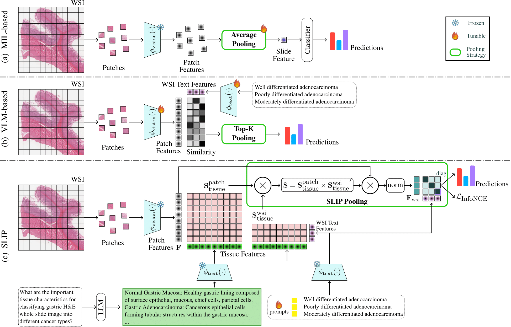

# SLIP: Slide-Level Prompt Learning with Vision Language Models for Few-Shot Multiple Instance Learning in Histopathology

This repository contains the official PyTorch implementation of our ISBI 2025 paper:

**"Slide-Level Prompt Learning with Vision Language Models for Few-Shot Multiple Instance Learning in Histopathology"**

---

## 🧠 Overview

SLIP is a novel framework that leverages **vision-language models (VLMs)** to tackle the challenging problem of **few-shot multiple instance learning (MIL)** in histopathology. Traditional MIL approaches rely on aggregation functions over instance-level features and require extensive labeled data. In contrast, SLIP leverages pathological prior knowledge extracted from language models (e.g., ChatGPT) to identify key tissue types and guide attention across WSIs. By aligning patch-level features with tissue-aware prompts and aggregating them via SLIP pooling, the model enables accurate WSI-level predictions using only a few labeled slides per class. Our approach consistently outperforms both MIL- and VLM-based baselines in low-data regimes.

---

## 🖼️ Framework

  

> **Figure:** Overview of the proposed method vs. existing MIL- and VLM-based approaches for few-shot WSI classification.
(a) Conventional MIL methods use pooling functions such as average pooling over patch features for slide-level predictions.
(b) VLM-based methods compute patch-text similarity using slide-level class prompts, often combined via top-K pooling.
(c) Our SLIP framework introduces SLIP pooling, which computes similarity between patch features and tissue-specific text embeddings (from ChatGPT), and between slide-level features and tissue-type names. These are aggregated to form class-specific slide representations for robust few-shot classification.

---
If you find our work useful, please consider citing:

@inproceedings{tomar2025slip,
  title     = {Slide-Level Prompt Learning with Vision Language Models for Few-Shot Multiple Instance Learning in Histopathology},
  author    = {Tomar, Devavrat and Vray, Guillaume, Mahapatra, Dwarikanath and Roy, Sudipta and Thiran, Jean-Philippe and Bozorgtabar, Behzad},
  booktitle = {IEEE International Symposium on Biomedical Imaging (ISBI)},
  year      = {2025}
}

